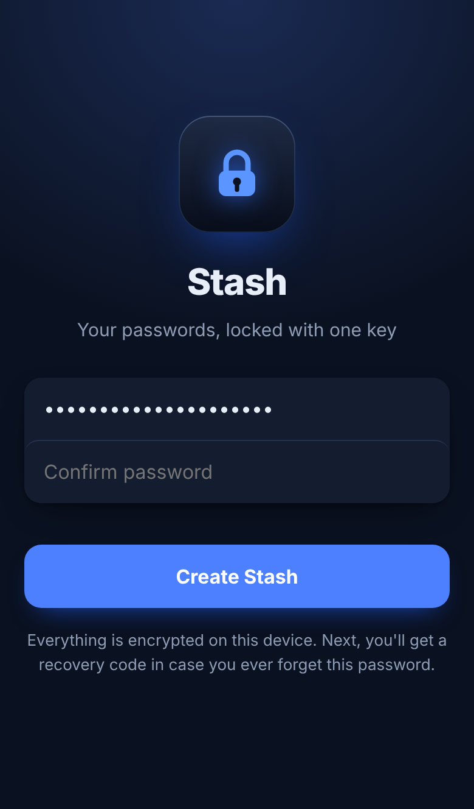
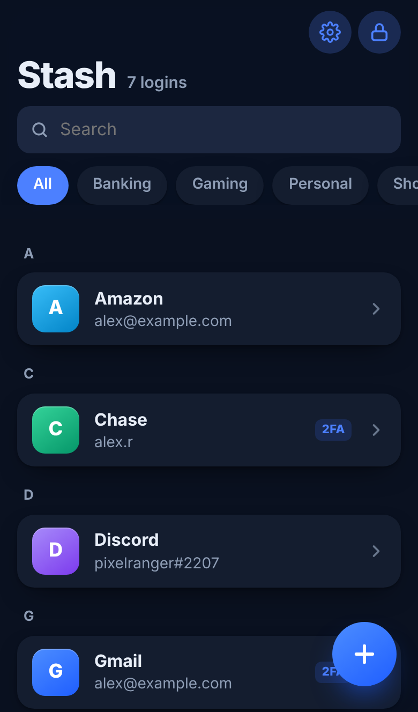
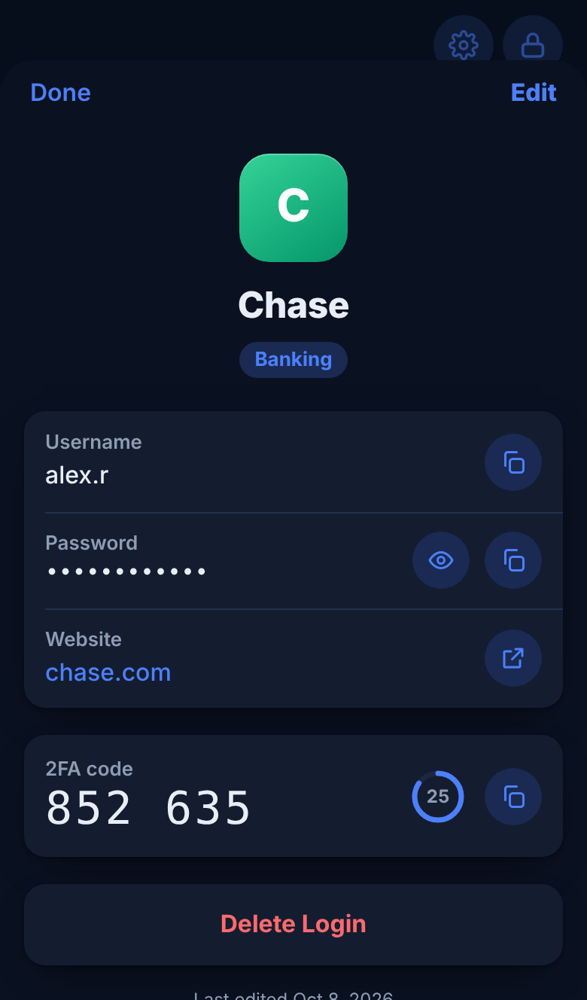
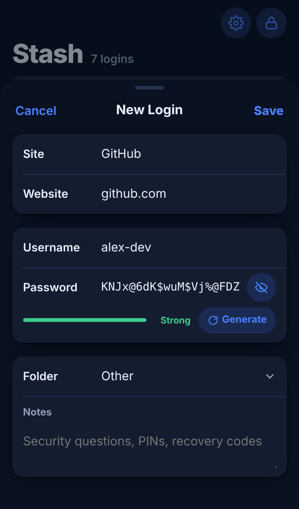
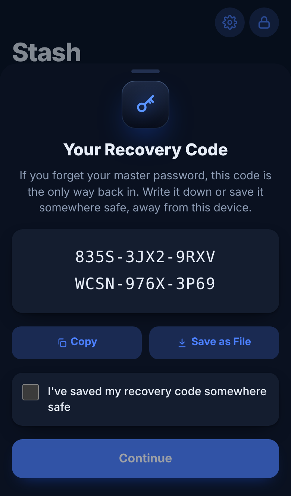
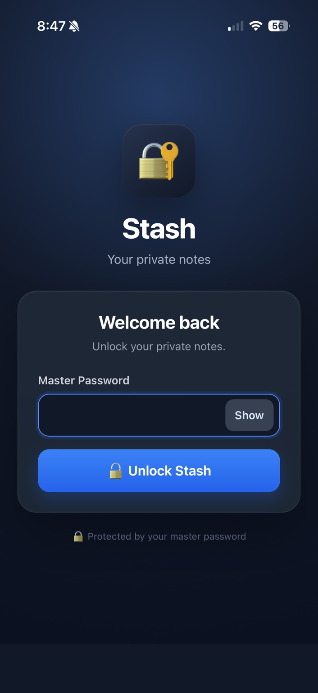
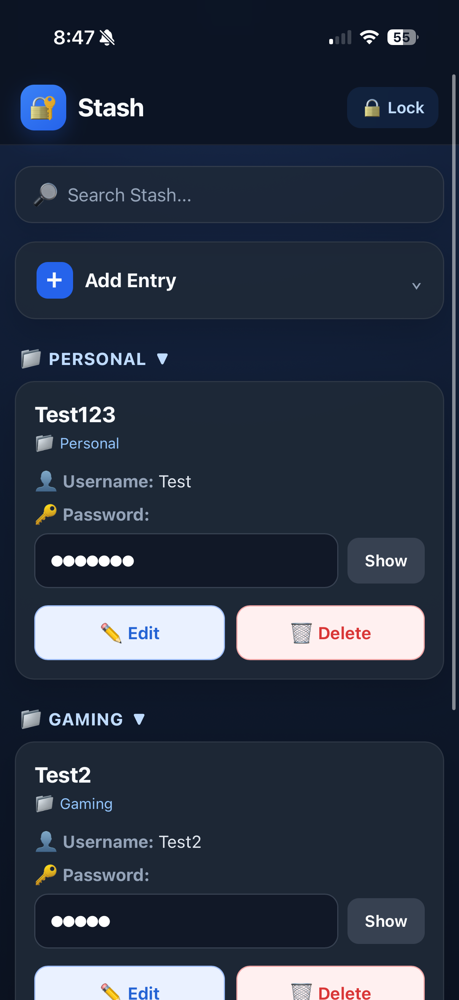
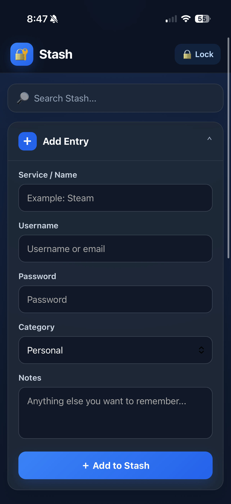

# Stash Notes App

Stash is a small, self-hosted personal notes application built for keeping organized records such as account usernames, passwords, categories, and notes. It is intentionally a **notes app**, not a full password-manager replacement.

Because Stash can contain real credentials, the deployed version includes encryption, authentication, session isolation, automatic locking, HTTPS access through Tailscale, firewall hardening, and encrypted backups.

## Stash v2 at a glance

<table>
<tr>
<td align="center"><strong>Unlock</strong></td>
<td align="center"><strong>Logins</strong></td>
<td align="center"><strong>Login details</strong></td>
<td align="center"><strong>New login</strong></td>
<td align="center"><strong>Recovery code</strong></td>
</tr>
<tr>
<td align="center"></td>
<td align="center"></td>
<td align="center"></td>
<td align="center"></td>
<td align="center"></td>
</tr>
</table>

<sub>Screenshots use made-up sample data.</sub>

## Versions

| | **Stash v2** (latest) | **Stash v1** (original) |
|---|---|---|
| Location in repo | [`v2/`](v2/) | `app.py` (repo root) |
| Type | Installable phone app (PWA) | Flask web app on the server |
| Where logins are stored | Encrypted on the phone itself | Encrypted in SQLite on the server |
| Encryption | AES-256-GCM | Fernet (AES-128-CBC + HMAC-SHA256) |
| Key derivation | PBKDF2-HMAC-SHA256, 600,000 rounds | PBKDF2-HMAC-SHA256, 600,000 rounds |
| Minimum master password | 12 characters | 12 characters |
| Forgot master password | Reset with a recovery code | Not supported |
| Works offline | Yes | No |
| Backups | Encrypted backup file from inside the app | Manual GPG-encrypted archive |
| Auto-lock | 5 minutes idle + manual lock | 15 minutes + manual lock |
| Hosting | Static files via `tailscale serve` (no Python needed) | Gunicorn + systemd + Tailscale Serve |

v1 is kept in this repository unchanged so the project history shows how Stash evolved.

# Stash v2

Stash v2 is a rebuild of Stash as an installable phone app. It adds to the home screen with its own icon, opens full screen, works offline, and keeps every login encrypted on the device. The server only hands out the app's files; it never sees or stores your logins.

### What's new in v2

- **Installable app:** add to the home screen on iPhone or Android; runs full screen with its own icon.
- **On-device encryption:** logins are encrypted with AES-256-GCM before they are saved, using a key protected by your master password.
- **Recovery codes:** a 24-character recovery code can reset a forgotten master password without losing any logins.
- **Works offline:** after the first install, Stash opens without a network connection.
- **Password generator** with a strength meter, and a warning dot on weak saved passwords.
- **Folders:** Personal, Gaming, Shopping, Social Media, Banking, Homelab and Other, with filter chips.
- **Search** across sites, usernames, websites, notes and folders.
- **One-tap copy** for usernames and passwords.
- **Encrypted backups** that open with either the master password or the recovery code.
- **Redesigned dark interface.**

See [`v2/README.md`](v2/README.md) for setup and the security design, and [`CHANGELOG.md`](CHANGELOG.md) for the full list of changes.

---

# Stash v1 (original Flask version)

Everything below documents the original server-based version, which remains in this repository as `app.py`.

## What Stash looks like

These are screenshots of the actual Stash app running on a mobile device.

<table>
<tr>
<td align="center"><strong>Unlock Screen</strong></td>
<td align="center"><strong>Main Screen</strong></td>
<td align="center"><strong>Add Entry</strong></td>
</tr>
<tr>
<td align="center"></td>
<td align="center"></td>
<td align="center"></td>
</tr>
</table>

## Current deployment

- **Host OS:** Ubuntu 26.04.1 LTS
- **Python:** 3.14.1
- **Framework:** Flask 3.1.3
- **Database:** SQLite
- **Application server:** Gunicorn
- **Service manager:** systemd (`stash.service`)
- **External access:** Tailscale Serve with HTTPS
- **Application bind address:** `127.0.0.1:5000`
- **Firewall:** UFW
- **Mobile client tested:** iPhone using Brave

The application is deliberately bound to localhost. Tailscale Serve provides the HTTPS entry point instead of exposing Flask/Gunicorn directly on the LAN or Internet.

## Features implemented

### Notes and organization

- Add, edit, and delete entries.
- Store name, username, password, category, and notes.
- Search entries.
- Organize entries into categories/folders.
- Clickable folder headers with collapse/expand arrows.
- Password show/hide control.
- Mobile-friendly, app-like interface.
- Stash-branded login and main interface.
- Manual Lock button.

### Authentication and security

- Master-password login.
- Master password is not stored directly.
- Minimum master-password length is 12 characters.
- Password verification uses a stored verifier and a random salt.
- Entry fields are encrypted with Fernet.
- Encryption key is derived from the master password using PBKDF2-HMAC-SHA256 with 600,000 iterations and a random 16-byte salt.
- Encrypted fields include name, username, password, category, and notes.
- Per-browser login sessions: one browser session does not automatically unlock another browser session.
- Automatic lock after 15 minutes.
- Manual lock is available from the main UI.

### Network and deployment hardening

- Gunicorn runs the Flask application under systemd.
- Stash listens only on `127.0.0.1:5000`.
- Tailscale Serve terminates/provides HTTPS access and proxies to the local application.
- UFW is enabled with incoming traffic denied by default.
- The Tailscale interface is allowed through UFW so Stash remains reachable through the Tailscale network.
- Port 5000 is **not** directly exposed.
- SSH was checked during hardening and was inactive on the host at that time.

## Runtime files

The deployed application uses files such as:

```text
~/stash/
├── app.py
├── stash.db
├── stash_config.json
├── stash_session_secret
└── venv/
```

The database, configuration, session secret, virtual environment, and backups are deployment state and must not be committed to this public repository. See `docs/SECURITY.md` and `.gitignore`.

## Installation / environment

Create the application directory and virtual environment:

```bash
mkdir -p ~/stash
cd ~/stash
python3 -m venv venv
source venv/bin/activate
```

Install the application dependencies used by the deployed version:

```bash
pip install flask cryptography gunicorn
```

The production application is run by systemd/Gunicorn rather than Flask's development server.

## Basic operation

Check the service:

```bash
sudo systemctl status stash.service
sudo systemctl is-active stash.service
```

Restart after application changes:

```bash
sudo systemctl restart stash.service
```

Verify localhost binding:

```bash
sudo ss -lntp | grep ':5000'
```

Expected binding:

```text
127.0.0.1:5000
```

Check Tailscale Serve:

```bash
tailscale serve status
```

Check firewall:

```bash
sudo ufw status verbose
```

## Tailscale access

Tailscale Serve is configured so the HTTPS Tailscale hostname proxies to:

```text
https://<your-tailscale-hostname>
        ↓
http://127.0.0.1:5000
```

The actual personal Tailscale hostname is intentionally not recorded in this public repository.

## UFW hardening

The deployed firewall configuration uses a deny-by-default incoming policy and permits traffic on the Tailscale interface.

Inspect it with:

```bash
sudo ufw status verbose
```

The important properties are:

- Incoming: deny by default.
- Outgoing: allow by default.
- Tailscale interface: allowed.
- Port 5000: **not** exposed directly.

## Backup and recovery

A final backup was created outside the Git repository under:

```text
~/stash-backups/
```

The important application state copied into the final backup was:

```text
app.py
stash.db
stash_config.json
stash_session_secret
```

A compressed archive was created, followed by a password-protected GPG copy using AES-256.

The final encrypted backup filename was:

```text
stash-final-backup.tar.gz.gpg
```

The GPG password is separate from the application's master password and is never stored in this repository.

See `docs/BACKUPS.md` for the complete backup and recovery procedure.

## Security notes

Stash is a personal self-hosted application. It is not intended to replace a mature, professionally audited password manager for high-risk secrets or multi-user deployments.

Operational rules:

1. Never commit `stash.db`, `stash_config.json`, `stash_session_secret`, passwords, or backup files to Git.
2. Never put the Stash master password or GPG backup password in documentation.
3. Keep the GPG backup password separately from the encrypted backup.
4. Keep the application bound to localhost when using Tailscale Serve.
5. Keep the host firewall enabled.
6. Back up the database and configuration together; the salt/configuration and session secret are part of the recovery state.
7. Test a recovery procedure periodically rather than assuming a backup works.

## Project status

The deployed Stash setup has been completed and tested for normal login/use, mobile access, folder collapse/expand, edit/delete controls, 15-minute automatic locking, per-browser login sessions, localhost-only binding, Tailscale HTTPS access, UFW protection, and encrypted backup creation/verification.

## Documentation

- `v2/README.md` — Stash v2 setup, hosting with Tailscale, and security design.
- `CHANGELOG.md` — what changed between versions.
- `docs/SETUP.md` — step-by-step deployment and configuration history.
- `docs/SECURITY.md` — security model, secrets, network exposure, and operational precautions.
- `docs/BACKUPS.md` — backup, encryption, verification, and recovery procedures.
